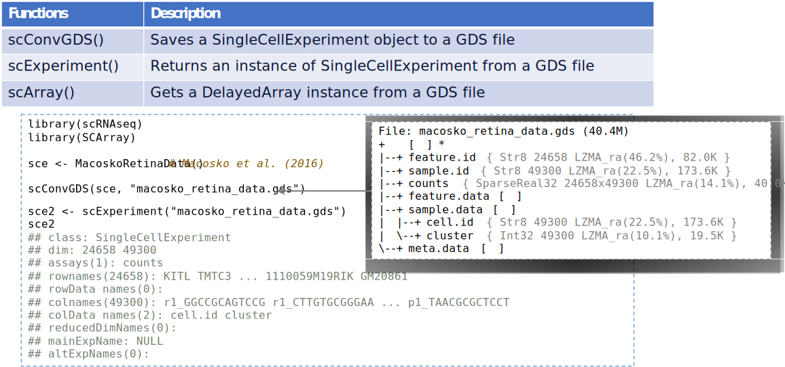
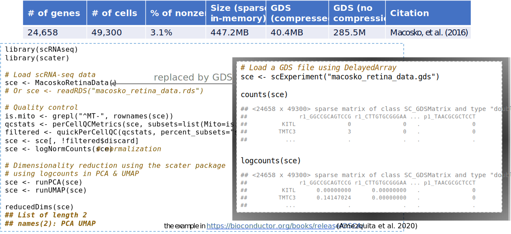

## Introduction

- Single-cell technology development
    * larger and larger numbers of cells assayed per experiment
    * the scalability leveraging on-disk data processing (avoid out of memory)
- Genomic Data Structure (GDS) files
    * an alternative to HDF5 & TileDB
    * hierarchical structure to store array-oriented data sets
    * compress & decompress data internally
    * out-of-memory data storage and manipulation in R
- SCArray
    * applies GDS to single-cell data manipulation & analysis
    * utilizes DelayedArray & SingleCellExperiment in BioC
    * reuse existing analysis packages efficiently (e.g., scater) via internal "seed-aware" functions

## Workflow & Data Structure

## Key Functions in SCArray

## Example: Small-size Dataset

## Example: Large-size Dataset (1.3M mouse brain cells)

## Discussion

* SCArray
  - under development
  - GDS as a file-based representation
    - a DelayedArray backend
    - for large-scale single-cell data storage & manipulation
  - leverage existing analysis R packages (e.g., scater)
    - via DelayedMatrix
* Plans
  - further integrate with Bioconductor infrastructure
    - GDSArray, DelayedMatrixStats, ...
  - reimplement some memory-intensive algorithms

## Acknowledgements

* Genomics Research Center (GRC), AbbVie
  - Astrid Wachter
  - Priyanka Vijay
  - Yating(Claire) Chai
  - Zheng Zha

* Bioconductor
  - Qian Liu (Roswell Park Comprehensive Cancer Center)

* National Center for Supercomputing Applications (NCSA)
  - University of Illinois at Urbana-Champaign (UIUC)
