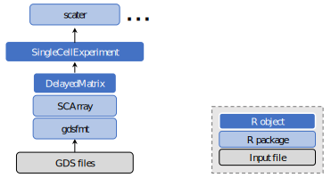

```{r echo=FALSE}
options(width=110)
```

~

~

## Introduction

The SCArray package provides large-scale single-cell RNA-seq data manipulation
using Genomic Data Structure
([GDS](http://www.bioconductor.org/packages/gdsfmt)) files. It combines
dense/sparse matrices stored in GDS files and the Bioconductor infrastructure
framework
([SingleCellExperiment](http://www.bioconductor.org/packages/SingleCellExperiment)
and [DelayedArray](http://www.bioconductor.org/packages/DelayedArray)) to
provide out-of-memory data storage and manipulation using the R programming
language. As shown in the figure, SCArray provides a `SingleCellExperiment`
object for downstream data analyses. GDS is an alternative to HDF5.
Unlike HDF5, GDS supports the direct storage of a sparse matrix without
converting it to multiple vectors.



~

~

## Installation

* Requires R (>= v3.5.0),
[gdsfmt](http://www.bioconductor.org/packages/gdsfmt) (>= v1.24.0)

* Bioconductor repository

To install this package, start R and enter:
```{R, eval=FALSE}
if (!requireNamespace("BiocManager", quietly=TRUE))
    install.packages("BiocManager")
BiocManager::install("SCArray")
```

~

~

## Format conversion

### Conversion from SingleCellExperiment

The SCArray package can convert a single-cell experiment object
(SingleCellExperiment) to a GDS file using the function `scConvGDS()`.
For example,

```{r}
suppressPackageStartupMessages(library(SCArray))
suppressPackageStartupMessages(library(SingleCellExperiment))

# load a SingleCellExperiment object
fn <- system.file("extdata", "example.rds", package="SCArray")
sce <- readRDS(fn)

# convert to a GDS file
scConvGDS(sce, "test.gds")

# list data structure in the GDS file
(f <- scOpen("test.gds"))
scClose(f)
```

### Conversion from a matrix

The input of `scConvGDS()` can be a dense or sparse matrix for count data:

```{r}
library(Matrix)

cnt <- matrix(0, nrow=4, ncol=8)
set.seed(100); cnt[sample.int(length(cnt), 8)] <- rpois(8, 4)
(cnt <- as(cnt, "sparseMatrix"))

# convert to a GDS file
scConvGDS(cnt, "test.gds")
```

~

~

## Examples

When a single-cell GDS file is available, users can use `scExperiment()` to
load a SingleCellExperiment object from the GDS file. The assay data in the
SingleCellExperiment object are DelayedMatrix objects.

```{r}
# a GDS file in the SCArray package
(fn <- system.file("extdata", "example.gds", package="SCArray"))
# load a SingleCellExperiment object from the file
sce <- scExperiment(fn)
sce

# it is a DelayedMatrix (the whole matrix is not loaded)
assays(sce)$counts

# column data
colData(sce)
# row data
rowData(sce)
```

~

~

## Data Manipulation and Analysis

SCArray provides a `SingleCellExperiment` object for downstream data analyses.
At first, we create a log count matrix `logcnt` from the count matrix.
Note that `logcnt` is also a DelayedMatrix without actually generating the
whole matrix.
```{r}
cnt <- assays(sce)$counts
logcnt <- log2(cnt + 1)
logcnt
```
**Formally**, we call `logNormCounts()` in the scuttle package to normalize the raw counts.

```{r}
suppressPackageStartupMessages(library(scuttle))

sce <- logNormCounts(sce)
logcounts(sce)
```


### 1. Row and Column Summarization

The [DelayedMatrixStats](http://www.bioconductor.org/packages/DelayedMatrixStats) package provides summarization functions operating on rows and columns of DelayedMatrix objects. SCArray has provided the optimized implementations for the row and column summarization. For example, we can calculate the mean for each column or row of the log count matrix.

```{r}
col_mean <- colMeans(logcnt)
str(col_mean)
row_mean <- rowMeans(logcnt)
str(row_mean)

# calculate the mean and variance at the same time
mvar <- scRowMeanVar(logcnt)
head(mvar)
```

### 2. PCA analysis

The [scater](http://www.bioconductor.org/packages/scater) package can perform the Principal component analysis (PCA) on the normalized cell data.

```{r}
suppressPackageStartupMessages(library(scater))

# run umap analysis
sce <- runPCA(sce)
```
`scater::runPCA()` will call the function `beachmat::realizeFileBackedMatrix()` internally to realize a scaled and centered DelayedMatrix into its corresponding in-memory format, so it is memory-intensive for large-scale PCA.

**Instead**, the SCArray package provides `scRunPCA()` for reducing the memory usage in large-scale PCA by perform SVD on the relatively small covariance matrix.

```{r}
sce <- scRunPCA(sce)
```

`plotReducedDim()` plots cell-level reduced dimension results (PCA) stored
in the SingleCellExperiment object:

```{r fig.align="center",fig.width=4,fig.height=3}
plotReducedDim(sce, dimred="PCA")
```

### 3. UMAP analysis

The [scater](http://www.bioconductor.org/packages/scater) package can perform the uniform manifold approximation and projection (UMAP) for the cell data, based on the data in a SingleCellExperiment object.

```{r}
suppressPackageStartupMessages(library(scater))

# run umap analysis
sce <- runUMAP(sce)
```

`plotReducedDim()` plots cell-level reduced dimension results (UMAP) stored
in the SingleCellExperiment object:

```{r fig.align="center",fig.width=4,fig.height=3}
plotReducedDim(sce, dimred="UMAP")
```

~

~

## Session Information

```{r}
# print version information about R, the OS and attached or loaded packages
sessionInfo()
```

```{r echo=FALSE}
unlink("test.gds", force=TRUE)
```
